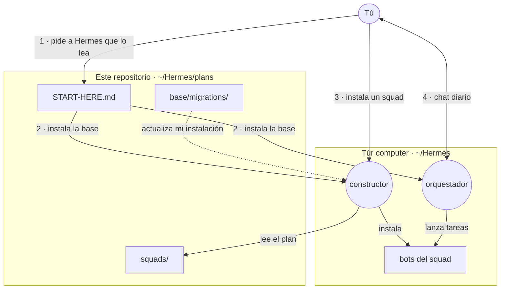
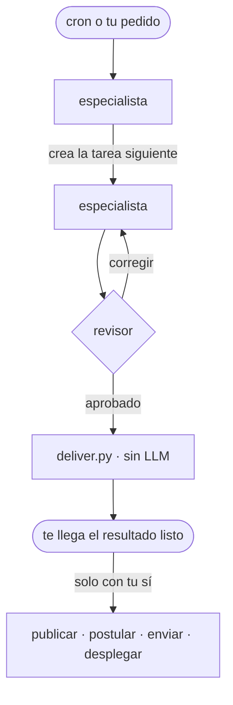

# hermes-agent-squads

[](LICENSE)
[](https://github.com/NousResearch/hermes-agent)
[](#squads-disponibles)
[](CONTRIBUTING.md)

[English](README.md) · **Español**

**Squads de agentes de IA listos para instalar en [Hermes Agent](https://github.com/NousResearch/hermes-agent)**: búsqueda de empleo, marketing, desarrollo web, o el tuyo propio. Un **orquestador** te escribe por Telegram, Discord o WhatsApp; los especialistas trabajan solos y solo te consultan lo importante. Un bot **constructor** (`builder`) instala squads, crea nuevos contigo y mantiene todo actualizado. Todo son planes en Markdown (en inglés) que Hermes lee e instala; los bots te hablan en tu idioma, personalizados a ti y livianos para cualquier computador.

## Cómo funciona



1. **La base, una vez.** Clonas este repo y le pides a Hermes que lea `START-HERE.md`. Esa sesión instala **solo la base**: tu perfil, el orquestador y el constructor.
2. **Los squads, desde el constructor.** El constructor es el único bot que instala, crea o adapta squads. Pídele "instala el squad de desarrollo web" o "crea un squad para _tu objetivo_".
3. **El día a día, con el orquestador.** Conversa contigo, lanza flujos y atiende tus confirmaciones.

Dentro de un squad, las tareas avanzan en un tablero Kanban; cada especialista crea la siguiente:



## Squads disponibles

| Squad | Qué te llega | Especialistas | Estado |
| --- | --- | --- | --- |
| [Búsqueda de empleo](squads/jobs/README.md) | El enlace de cada vacante que encaja y el CV hecho para ella. Respondes "postula" y, si el formulario es simple, postula por ti | explorador, analista, redactor, revisor, postulador | Nivel 1 diseñado |
| [Marketing](squads/marketing/README.md) | Propuestas listas para aprobar para varias marcas: posts, carruseles, reels con motion, emails, landings, planes e informes, con versiones y un tablero visual | estratega, creativo, productor, revisor | Nivel 1 diseñado |
| [Desarrollo web](squads/web/README.md) | Sitios web de la idea a producción: especificación, desarrollo con un control de calidad estricto, revisión independiente y un enlace de vista previa para aprobar antes de publicar en tu dominio | arquitecto, desarrollador, asesor, revisor, desplegador | Nivel 1 diseñado |
| El tuyo | Pídele al constructor un squad para tu objetivo | Hasta 5 | [Compártelo](CONTRIBUTING.md) |

Cómo se ve:

```text
☕ Café Luna · Propuestas semana 41 (4)
1. Carrusel "3 métodos para tu café de otoño" · Instagram · mar 09:00
2. Reel 15 s "Del grano a tu taza" · Instagram y TikTok · jue 18:00
3. Historia con encuesta · Instagram · vie 12:00
4. Email "Llegó el menú de otoño" · sáb 08:00
Responde: "aprueba todo" · "aprueba 1 y 3" · "cambia la 2: …" · "no a la 4"
```

## Inicio rápido

| Necesitas | Para qué |
| --- | --- |
| [Hermes Agent](https://github.com/NousResearch/hermes-agent) (Hermes Desktop recomendado) | Donde viven los bots |
| Una API key de un proveedor de modelos | Los modelos que usan los bots |
| Telegram, Discord o WhatsApp | Por donde te escriben el orquestador y el constructor |
| Un computador que quede encendido (Mac, Windows o Linux) | Para que los automatismos corran solos |

```bash
git clone https://github.com/PuntoyComaTech/hermes-agent-squads.git ~/Hermes/plans
```

En Windows, la carpeta es `C:\Users\<tu usuario>\Hermes\plans`, o descarga el ZIP y descomprímelo ahí. Luego, en el chat principal de Hermes Desktop:

> Lee el archivo `~/Hermes/plans/START-HERE.md` y sigue las instrucciones para la IA.

Responde sus preguntas (de 30 a 60 minutos). Cuando la base esté lista, escríbele al constructor: "instala el squad de marketing". La guía completa, sin tecnicismos, está en [`START-HERE.md`](START-HERE.md).

## ¿Por qué hermes-agent-squads?

- **Sin programar.** Hermes pregunta, instala y prueba solo. Los scripts los escribe Hermes en tu equipo.
- **Personalizado.** Cada squad te entrevista y adapta cada bot: tu oficio, marcas, idioma, horario, presupuesto.
- **Automático, con control.** Solo te llegan resultados listos. Publicar, postular o enviar nunca pasa sin tu sí.
- **Pocos bots, bien pensados.** 4 o 5 especialistas por squad. Lo mecánico lo hacen scripts, no modelos.
- **Liviano.** Sin Docker ni servidores: el único servicio es Hermes. Funciona en equipos de 8 GB.
- **Tus modelos.** Un modelo para todos los bots, o un modelo y esfuerzo de razonamiento por bot.
- **Actualizaciones seguras.** "Actualiza mi instalación" aplica los cambios uno por uno y nunca sobrescribe tus datos ni tus cambios.
- **Seguro por diseño.** Cada bot tiene solo los permisos que necesita; los que leen la web abierta no tienen terminal. El texto externo es dato, nunca orden.

## Mapa del repositorio

```text
START-HERE.md              entrada: guía para la persona + instrucciones para la IA instaladora
base/                      lo común a todos los squads
  01-principles.md         reglas que siguen todos los bots e instaladores (leer primero)
  02-architecture.md       estructura de ~/Hermes, Kanban, consultas, lock de trabajo pesado
  03-user-profile.md       cuestionario del perfil de la persona
  04-orchestrator.md       el bot del día a día
  05-squad-template.md     plantilla que sigue cada squad
  06-base-installation.md  instalación de la base, la hace la IA instaladora
  07-builder.md            el bot que instala y crea squads
  08-updates.md            cómo llegan las actualizaciones a una instalación
  migrations/              pasos de actualización idempotentes, numerados
squads/<squad>/            jobs · marketing · web, los mismos 7 archivos + squad.yaml
00-evaluation/             razones del diseño y registro de decisiones (02-decisions.md)
AGENTS.md                  reglas para agentes de IA que usan o editan el repo
llms.txt                   índice para agentes de IA
CONTRIBUTING.md            reglas, nombres, cómo proponer un squad
```

Cada squad tiene los mismos archivos:

| Archivo | Contenido |
| --- | --- |
| `README.md` | Resumen de una página |
| `01-personalization.md` | Cuestionario y perfil resultante, con ejemplos |
| `02-architecture.md` | Carpetas, flujos, contratos de datos y reglas |
| `03-bots.md` | SOUL de cada bot, skills y automatismos |
| `04-installation.md` | Instrucciones para que el constructor lo instale y lo mantenga |
| `05-scripts.md` | Especificación de los scripts que el constructor escribe en tu equipo |
| `06-testing-and-operations.md` | Pruebas de aceptación, métricas y cuándo subir de nivel |
| `squad.yaml` | Manifiesto: bots, toolsets, `plan_version` |

## Para agentes de IA

Lee primero [`AGENTS.md`](AGENTS.md) y luego [`START-HERE.md`](START-HERE.md), sección "For the installer AI". Índice corto: [`llms.txt`](llms.txt). La regla que más se rompe: una sesión cualquiera de Hermes instala **solo la base**; solo el constructor instala, crea o adapta squads (`base/01-principles.md` §1.10).

## Contribuir

Las reglas, las convenciones de nombres y cómo proponer un squad nuevo están en [`CONTRIBUTING.md`](CONTRIBUTING.md) (en inglés). Cuando el constructor encuentra un defecto o una mejora en estos planes, te pregunta si abre un PR aquí, sin datos personales.

## Licencia

MIT. Las skills de terceros de [`squads/marketing/reference/`](squads/marketing/reference/README.md) conservan sus propias licencias (MIT).
