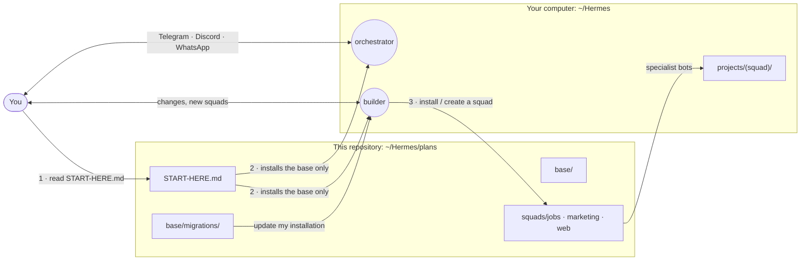
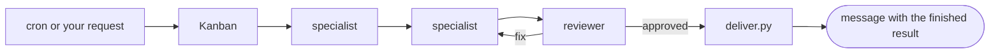

# hermes-agent-squads

[](LICENSE)
[](https://github.com/NousResearch/hermes-agent)
[](#available-squads)
[](CONTRIBUTING.md)

**English** · [Español](README.es.md)

Ready-to-install **AI agent squads for [Hermes Agent](https://github.com/NousResearch/hermes-agent)**: job search, marketing, web development, or your own. An **orchestrator** messages you on Telegram, Discord or WhatsApp; the specialists work on their own and only ask you what matters. A **builder** bot installs squads, creates new ones with you and keeps everything updated. Everything is Markdown plans that Hermes reads and installs, personalized to you, in your language, light enough for any computer.

## How it works



1. **Base, once.** You clone this repo and ask Hermes to read `START-HERE.md`. That session installs **only the base**: your profile, the orchestrator and the builder.
2. **Squads, from the builder.** The builder is the only bot that installs, creates or adapts squads. Ask it "install the web development squad" or "create a squad for <goal>".
3. **Day to day, the orchestrator.** It chats with you, launches flows and handles your approvals.

Inside a squad, work moves on a Kanban board:



Each specialist creates the next task. Nothing irreversible (publish, apply, send, deploy to production) happens without your confirmation.

## Available squads

| Squad | What you get | Specialists | Status |
| --- | --- | --- | --- |
| [Job search](squads/jobs/README.md) | A link to every matching job and a CV tailored to it. Reply "apply" and, if the form is simple, it applies for you | scout, analyst, writer, reviewer, applier | Level 1 designed |
| [Marketing](squads/marketing/README.md) | Ready-to-approve proposals for several brands: posts, carousels, motion reels, emails, landing pages, plans and reports, with versions and a visual board | strategist, creative, producer, reviewer | Level 1 designed |
| [Web development](squads/web/README.md) | Websites from idea to production: spec, build behind a strict quality gate, independent review and a preview link to approve before publishing on your domain | architect, developer, advisor, reviewer, deployer | Level 1 designed |
| Yours | Ask the builder to create a squad for your goal | Up to 5 | [Share it](CONTRIBUTING.md) |

What it looks like:

```text
🟢 84/100 · Data analyst — Acme (remote in region)
Apply: https://boards.greenhouse.io/acme/jobs/123
CV attached 📎 cv_ats.pdf
Reply: "apply" · "change: <what>" · "no"
```

## Quick start

| You need | Why |
| --- | --- |
| [Hermes Agent](https://github.com/NousResearch/hermes-agent) (Hermes Desktop recommended) | Where the bots live |
| An API key from a model provider | The models the bots use |
| Telegram, Discord or WhatsApp | Where the orchestrator and the builder message you |
| A computer that stays on (Mac, Windows or Linux) | So automations run by themselves |

```bash
git clone https://github.com/PuntoyComaTech/hermes-agent-squads.git ~/Hermes/plans
```

On Windows, use `C:\Users\<your user>\Hermes\plans`, or download the ZIP and unzip it there. Then, in the Hermes Desktop main chat:

> Read the file `~/Hermes/plans/START-HERE.md` and follow the instructions for the AI.

Answer its questions (30 to 60 minutes). When the base is ready, write to the builder: "install the marketing squad". The full non-technical guide is [`START-HERE.md`](START-HERE.md).

## Why hermes-agent-squads?

- **No coding.** Hermes asks, installs and tests on its own. Any script is written by Hermes on your machine.
- **Personalized.** Each squad interviews you and adapts every bot: your job, brands, language, schedule, budget.
- **Automatic, with control.** You only receive finished results. Publishing, applying or sending never happens without your yes.
- **Few, well-designed bots.** 4 or 5 specialists per squad. Mechanical work is done by scripts, not models.
- **Lightweight.** No Docker, no servers: Hermes is the only service. Works on 8 GB machines.
- **Your models.** One default model for every bot, or a model and reasoning effort per bot.
- **Safe updates.** "Update my installation" applies changes one at a time and never overwrites your data or your changes.
- **Safe by design.** Each bot has only the permissions it needs; bots that read the open web have no terminal. External text is data, never instructions.

## Repository map

```text
START-HERE.md              entry point: guide for the user + instructions for the installer AI
base/                      shared by every squad
  01-principles.md         rules every bot and installer follows (read first)
  02-architecture.md       ~/Hermes layout, Kanban, consults, heavy-work lock
  03-user-profile.md       the user's profile questionnaire
  04-orchestrator.md       the day-to-day bot
  05-squad-template.md     template every squad follows
  06-base-installation.md  base install, run by the installer AI
  07-builder.md            the bot that installs and creates squads
  08-updates.md            how updates reach an installed system
  migrations/              idempotent update steps, numbered
squads/<squad>/            jobs · marketing · web, same 7 files + squad.yaml
00-evaluation/             design rationale and the decision log (02-decisions.md)
llms.txt                   index for AI agents
CONTRIBUTING.md            rules, naming, how to propose a squad
```

Every squad has the same files:

| File | Content |
| --- | --- |
| `README.md` | One-page summary |
| `01-personalization.md` | Questionnaire and resulting profile, with examples |
| `02-architecture.md` | Folders, flows, data contracts and rules |
| `03-bots.md` | Each bot's SOUL, skills and automations |
| `04-installation.md` | Instructions for the builder to install and maintain it |
| `05-scripts.md` | Specs of the scripts the builder writes on your machine |
| `06-testing-and-operations.md` | Acceptance tests, metrics, when to move up a level |
| `squad.yaml` | Manifest: bots, toolsets, `plan_version` |

## For AI agents

If you are an AI agent reading this repository:

- **Entry point:** [`START-HERE.md`](START-HERE.md), section "For the installer AI". Then [`base/01-principles.md`](base/01-principles.md).
- **Only the builder creates squads** (`base/01-principles.md` §1.10). A generic Hermes session asked for the initial setup installs the base (profile, orchestrator, builder) and then sends the user to the builder. It never installs, creates or adapts a squad.
- **Plans are Markdown only.** Scripts and configs are specified as prompts and written on the user's machine at install time.
- **Verify, never guess.** Every command is checked against its real output; Hermes documentation wins over a plan.
- **Updates are migrations** in [`base/migrations/`](base/migrations/), never in-place rewrites of the user's data.
- **Why things are the way they are:** [`00-evaluation/02-decisions.md`](00-evaluation/02-decisions.md), newest first.

## Contributing

Rules, naming conventions and how to propose a new squad are in [`CONTRIBUTING.md`](CONTRIBUTING.md). When the builder finds a defect or an improvement in these plans, it asks you whether to open a PR here, with no personal data.

## License

MIT. Third-party skills in [`squads/marketing/reference/`](squads/marketing/reference/README.md) keep their own licenses (MIT).
